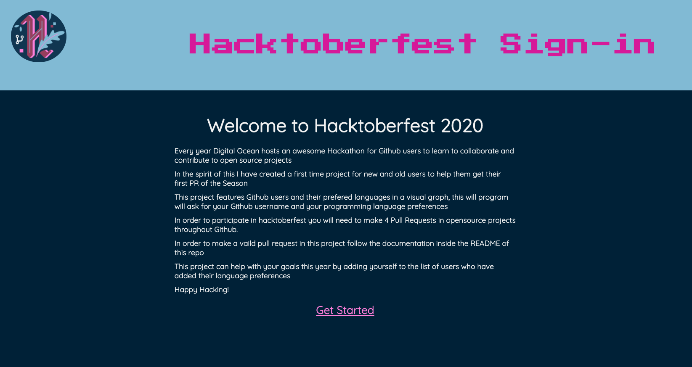
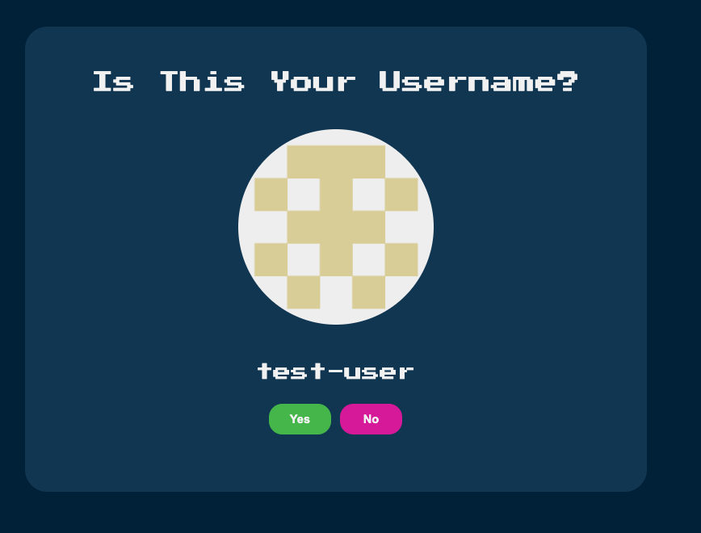
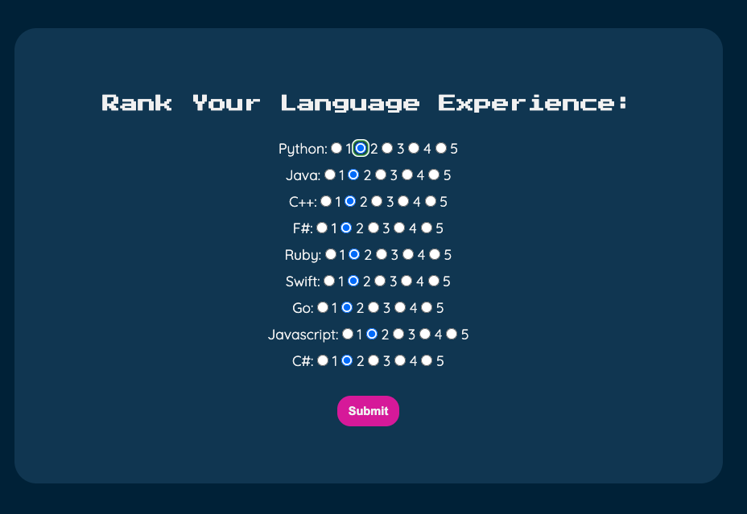
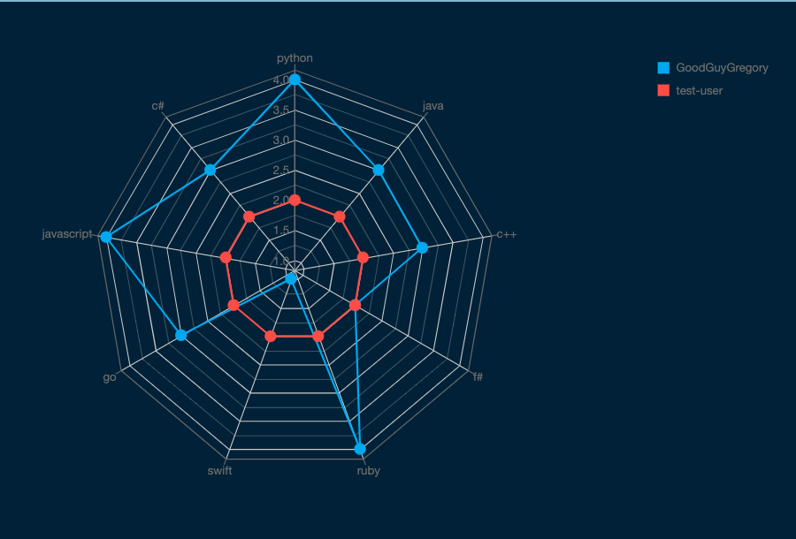
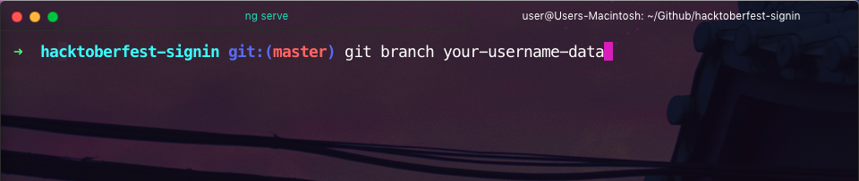
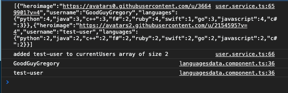
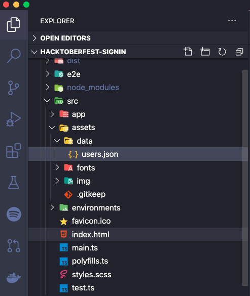
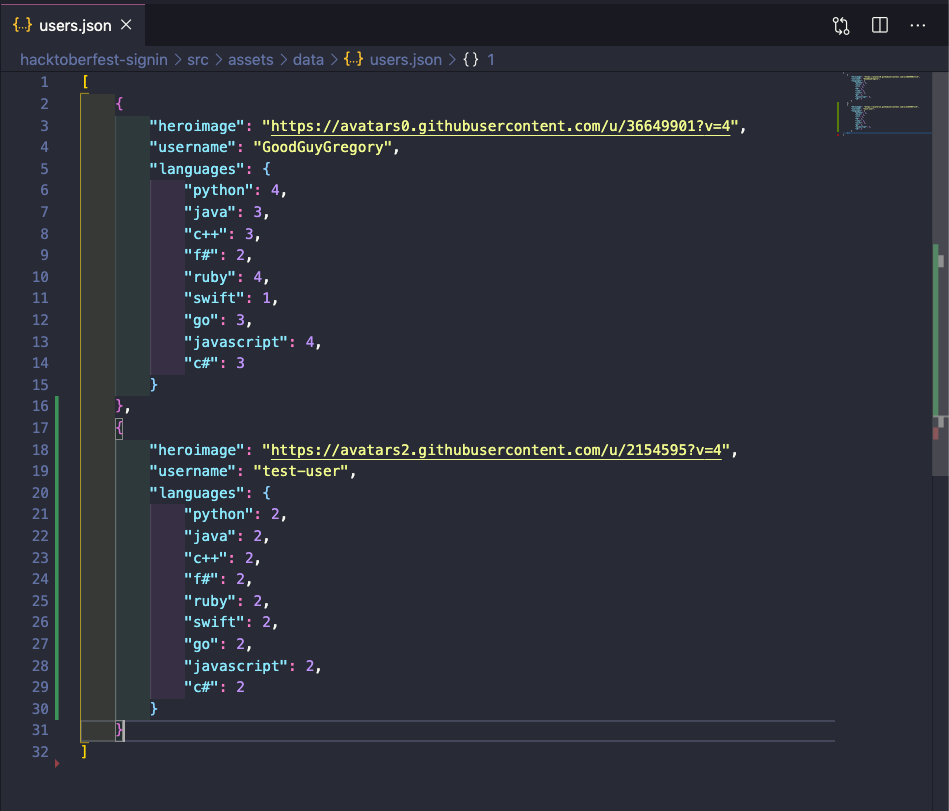

# Hacktoberfest Signin

## How to Contribute for your First PR

 ### Start the project

  follow the starting instructions inside of the repo in `hacktoberfest-signin/`

  inside of the `hacktoberfest-signin/` directory run `ng serve` this should open the project after compiling on your local computer open a browser window and type `localhost:4200` if this was compiled sucessfully you should see this in any browser window.

  

 ### Complete the Sign-in Process
 complete the form with your username from github 

  

  add your language preference data as below:

  

  before going any further keep the screen on the graph and view your awesome preferences compared to other developers.

  

### Add Your User Data to the Repo with a Pull Request 
  
make a new branch with your username  

before going any further open the javascript console for your data.

copy your `username` data from the javascript array and add it to the project. find the assets folder inside of the project directory

add your user data into the `users.json` file **(from the JS console in the browser you copied earlier)**

commit your changes to your local branch and push them to the upstream branch.

`HAPPY CODING!`

### Building a Community

Invite others to add their language data and I will continue working on the project throughout `Hacktoberfest` to add more functionality. 
